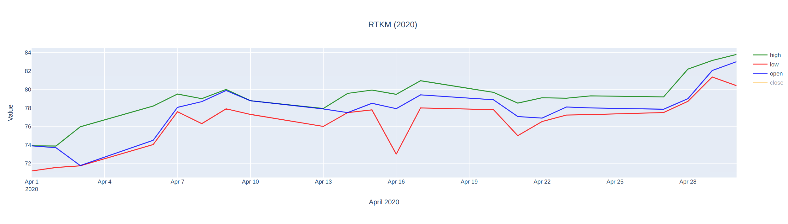
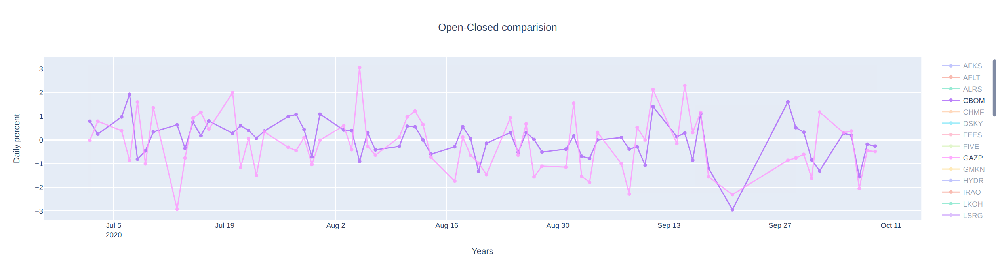

# Stock exchange tool

A simple tool for visualising and comparing stock exchange data using Django and Plotly. 
This tool has been created for educational purposes only.

The tool can build graphs using user data. For example:

single stock data by month and year


multiple stock data by the percentage
    ratio between the opening price and the closing price


# Installation
1. Clone the project
2. Create virtual environment for python version >= 3.8
```virtualenv venv -p python 3.9```
3. Create new DB (postgres is preferable)
```createdb db_name```
4. Copy and fill in example/example.conf
5. Install python requirements
```pip install -r REQUIREMENTS.txt```
6. Set up environment variables:
```DJANGO_SETTINGS_MODULE=src.settings```
```CONFIG_PATH=/path/to/stock_exchange.conf```
7. Migrate django migrations
```python manage.py migrate```
8. Download data to DB manually or using manage command (
for more information look at src/stocks/management/commands/export_data.py):
```python manage.py export_data --dir "/path/to/files"```
9. Run the project
```python manage.py runserver```